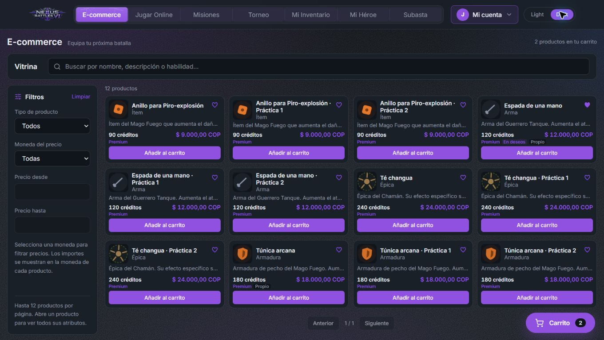
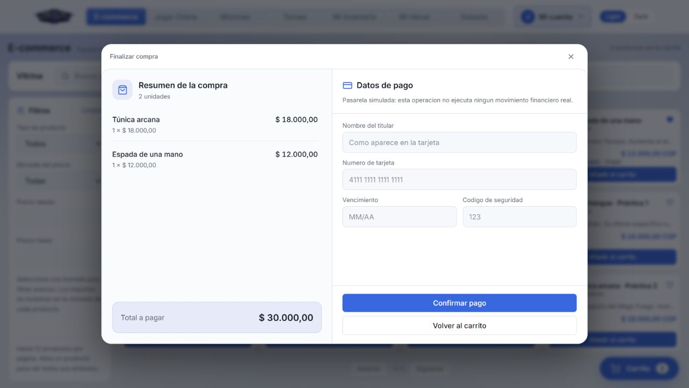

# Vitrina compacta y pago

La ruta `/ecommerce` tiene búsqueda permanente sobre el catálogo, filtros a la izquierda y páginas visibles de 12 productos. El adaptador conserva la paginación HTTP de Catalog (16 por petición): solicita como máximo dos páginas para completar una pantalla, sin descartar productos entre pantallas.

El carrito inicia minimizado en una burbuja. Al abrirlo aparecen productos, total, guardado y recuperación. El detalle completo y el pago usan diálogos nativos con foco contenido, cierre accesible y Escape. Durante el envío de un pago se bloquea el cierre; el seguimiento de un pedido en procesamiento puede cerrarse sin volver a enviarlo. El botón de retorno abre el carrito y la confirmación permite seguir comprando.

En escritorio de al menos 1200 × 768, la vitrina ocupa el espacio restante debajo de la navegación. Se verificaron 12 productos reales de una demo local en 1360 × 768: documento 1360 × 768, imágenes cargadas y ninguna tarjeta desbordada. En ventanas menores el contenido vuelve al flujo adaptable. En 390 × 844 no hay desplazamiento horizontal; el pago se apila y su contenido largo se desplaza dentro del panel. No se oculta el desbordamiento del documento.

El pago muestra los productos, cantidades y total del servidor a la izquierda del formulario. Las listas largas del carrito y del resumen tienen desplazamiento interno. Los atributos completos se consultan en el detalle del producto.

## Imágenes

`components/ui/ProductImage` centraliza la descarga autenticada de imágenes de nuestra API y el uso de un Blob revocable. Las imágenes externas nunca reciben el token. La vitrina, el carrito y la vista previa administrativa reutilizan ese componente. La vista previa anterior hacía una petición `img` anónima que recibía 401 después de finalizar correctamente el recurso.

## Verificación

- 714 pruebas aprobadas; cobertura de líneas 88,72 % y ramas 82,47 %.
- Lint, formato, tipos y compilación de producción aprobados.
- Regresión de páginas 12/12/1 sobre 25 resultados, filtros, detalle, deseos, carrito, guardado, resumen actualizado y compra.
- Recorrido de navegador sobre los servicios locales: 12 productos persistidos, 12 imágenes cargadas, guardado/recuperación, compra simulada por 30.000 COP y marcadores de adquisición.
- Notifications capturó el mensaje con dos productos y total en la bandeja de desarrollo. Esto no demuestra entrega SMTP externa ni despliegue público.

La prueba local también detectó un fallo del adaptador MongoDB de Catalog al guardar metadatos opcionales como `null`. Su corrección se mantiene en un cambio separado de Catalog, sin cambiar el contrato HTTP.

